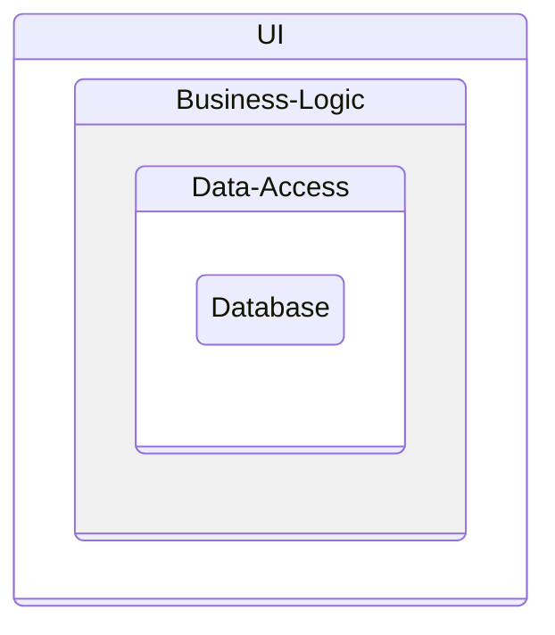

# Clean Architecture

Based on Mathew Renze's Pluralsight course (2016):  <https://app.pluralsight.com/library/courses/clean-architecture-patterns-practices-principles/>

Source Code: https://github.com/matthewrenze/clean-architecture-demo

and Ardalis: https://www.youtube.com/watch?v=tYoqmL6e4oY

## See also

<https://github.com/boeschenstein/ddd>

### Classic 3 Layer



### Domain Centric approaches

- Hexagonal: https://alistair.cockburn.us/hexagonal-architecture/
- Onion: https://jeffreypalermo.com/2008/07/the-onion-architecture-part-2/
- Clean: https://blog.cleancoder.com/uncle-bob/2012/08/13/the-clean-architecture.html
- Comparison aka it's all the same: https://blog.ploeh.dk/2013/12/03/layers-onions-ports-adapters-its-all-the-same/

### Application Layer

Overview


Interfaces


## CQS - Command and Query Separation

- Commands: change data (sideeffects)
- Queries: no data change allowed (idempotent)
- Where to use? everywhere: API, services, ...
- Theory: <https://martinfowler.com/bliki/CommandQuerySeparation.html>
- Examples: <https://khalilstemmler.com/articles/oop-design-principles/command-query-separation/>
- Wikipedia: <https://en.wikipedia.org/wiki/Command%E2%80%93query_separation>

### CQS in Database Access - Variants

- Single DB CQS
- 2 DB CQS
- Event Sourcing CQS

## Unit Testing

<https://github.com/boeschenstein/testing/tree/main>

## Layers

| Layer | Level | Short                  | Other Names                                            | Function                    | Hints
| ---   | ---   | ---                    |           ---                                          | ---                         | ---
| L4    | low   | Frameworks & Drivers   | Web, UI, DB, Devices, External Interfaces, ServiceHost |                             | not much code
| L3    |       | Interface Adapters     | Controller, Gateway, Presenter                         | Data Conversion, Formatting |
| L2    |       | Use Cases              | Interactors                                            | Application Business Rules  | Services 
| L1    | high  | Entities               | Domain                                                 | Enterprise Business Rules   | most stable (changes rarely)

- If you need more layers: add it
- Cross-Cutting concerns: across all layers
- use Dependency Inversion for external devices (DB, ...)

### Examples

Each line is a C# project:

```
Example 1:
	L4 Tests
	L4 Presentation
	L4 Persistence, Infrastructure
	L2+L3 Application
	L1 Entities: Domain

Example 2:
	L4 CLI
	L4 IO
	L1+L2+L3 Core

Example 3:
	L4 Tests
	L4 Frontend, Presentation UI, Web
	L4 Infrastructure, Persistance, IO
	L2+L3 Domain.Services
	L1 Entities: Domain

Example 4:
	L4 Tests
	L4 Frontend, Presentation UI, Web
	L4 Infrastructure, Persistance, IO
	L4 Hangfire (ServiceHost)
	L3 Application Services
	L2 Domain Services
	L1 Entities, Domain, DomainModel
```

## UML

UML Class Diagram <https://en.wikipedia.org/wiki/Class_diagram>

Source Code Dependencies:

```
-->  Open arrowheads are using relationships. 
-|>  Closed arrowheads are implements or inheritance relationships. "Dependency Inversion"
```

>Report Generator -> Data Service <|- Repository -> Database

## Create Solution

```PowerShell
dotnet new classlib --name MyApp.MyDomain

dotnet new classlib --name MyApp.MyDomain.MyServices
dotnet add MyApp.MyDomain.MyServices reference MyApp.MyDomain

dotnet new classlib --name MyApp.Infrastructure.MyDB
# Dependency Inversion: see Domain centric architectures (Clean Architecture, DDD and others)
dotnet add MyApp.Infrastructure.MyDB reference MyApp.MyDomain.MyServices

dotnet new webapi --name MyApp.MyWebApi
dotnet add MyApp.MyWebApi reference MyApp.MyDomain.MyServices
dotnet add MyApp.MyWebApi reference MyApp.Infrastructure.MyDB

# Test project
dotnet new xunit --name MyApp.MyTest
dotnet add MyApp.MyTest reference MyApp.MyDomain.MyServices
dotnet add MyApp.MyTest reference MyApp.Infrastructure.MyDB
dotnet add MyApp.MyTest reference MyApp.MyWebApi
# dotnet add MyApp.MyTest package xUnit
dotnet add MyApp.MyTest package Moq

# Solution
dotnet new sln --name MyApp
dotnet sln add MyApp.MyDomain
dotnet sln add MyApp.MyDomain.MyServices
dotnet sln add MyApp.Infrastructure.MyDB
dotnet sln add MyApp.MyWebApi
dotnet sln add MyApp.MyTest

# ADD NEW ANGULAR PROJECT
# 1) Create new Project, using "Standalone TypeScript Angular Template" in Visual Studio, add it (manually) to sln
# 2) port of 'target' in MyAngularApp\src\proxy.conf.js must be equal to port of https entry of MyWebApi in MyWebApi\Properties\launchSettings.json
# Details: https://learn.microsoft.com/en-us/visualstudio/javascript/tutorial-asp-net-core-with-angular?view=vs-2022

```

## Information

- Screaming Architecture: <https://levelup.gitconnected.com/what-is-screaming-architecture-f7c327af9bb2>
- Last Responsible Moment (LRM: wait as long as you can)
- Evolutionary Architecture
- Books
    - Martin Fowler: Patterns of Enterprise Application Architecture
    - Uncle Bob: Clean Architecture
- Web
    - Martin Fowler: https://martinfowler.com
    - Udi Dahan: https://udidahan.com
