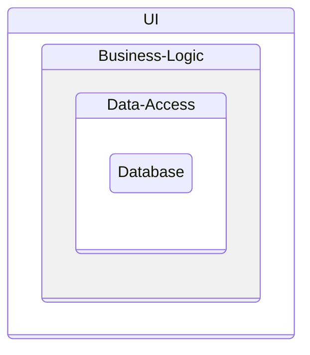

# Clean Architecture

Based on Mathew Renze's Pluralsight course:  <https://app.pluralsight.com/library/courses/clean-architecture-patterns-practices-principles/>

Source Code: https://github.com/matthewrenze/clean-architecture-demo

And Ardalis: https://www.youtube.com/watch?v=tYoqmL6e4oY

## History

### Classic 3 Layer

### Domain Centric approaches

- Hexagonal: https://alistair.cockburn.us/hexagonal-architecture/
- Onion: https://jeffreypalermo.com/2008/07/the-onion-architecture-part-2/
- Clean: https://blog.cleancoder.com/uncle-bob/2012/08/13/the-clean-architecture.html
- Comparison aka it's all the same: https://blog.ploeh.dk/2013/12/03/layers-onions-ports-adapters-its-all-the-same/

### Application Layer

Overview

Interfaces

## CQS - Command and Query 

<https://en.wikipedia.org/wiki/Command%E2%80%93query_separation>

### Variants

- Single DB CQS
- 2 DB CQS
- Event Sourcing CQS

## Unit Testing

## TDD - Test driven Developmenet

what        | why         | how
----------- | ----------- | --------------
unit        | functional  | autmated
integration | acceptance  | semi-automated
component   | smoke       | manual
service     | exploratory | 
UI          |             | 

Book: Succeeding with agile

| costs | Type          | number of tests  | 
| :---: | :-----------: | :--------------: | 
| ++++  | Manual tests  | +                | 
| +++   | UI tests      | ++               | 
| ++    | Service tests | +++              | 
| +     | Unit tests    | ++++             | 

### Acceptance Tests

- Verify functionality
- Language of business
- Criteria of completeness
- Full tests are problematic

How

- Eliminate UI
- Use In-Memory DB 
- Mock Infrastructure and Cross-Cutting Concernes

## Information

- Screaming Architecture: <https://levelup.gitconnected.com/what-is-screaming-architecture-f7c327af9bb2>
