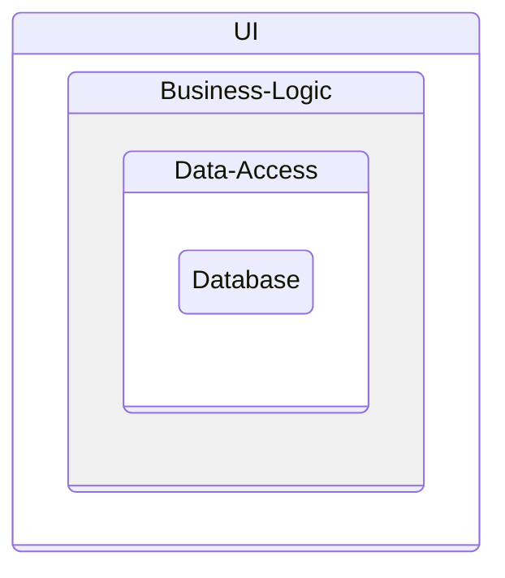

# Clean Architecture

Based on:  <https://app.pluralsight.com/library/courses/clean-architecture-patterns-practices-principles/>
By Mathew Renze
Source Code: https://github.com/matthewrenze/clean-architecture-demo

## History

### Classic 3 Layer

### Domain Centric approaches

- Hexagonal: https://alistair.cockburn.us/hexagonal-architecture/
- Onion: https://jeffreypalermo.com/2008/07/the-onion-architecture-part-2/
- Clean: https://blog.cleancoder.com/uncle-bob/2012/08/13/the-clean-architecture.html
- Comparison aka it's all the same: https://blog.ploeh.dk/2013/12/03/layers-onions-ports-adapters-its-all-the-same/

### Application Layer

Overview

Interfaces

## CQS

### Single DB CQS

### 2 DB CQS

### Event Sourcing CQS
