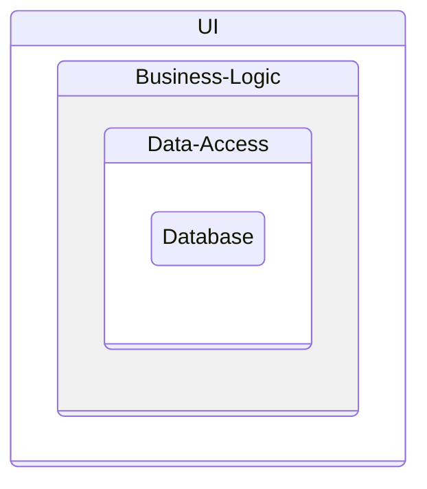

# Clean Architecture

Based on Mathew Renze's Pluralsight course (2016):  <https://app.pluralsight.com/library/courses/clean-architecture-patterns-practices-principles/>

Source Code: https://github.com/matthewrenze/clean-architecture-demo

And Ardalis: https://www.youtube.com/watch?v=tYoqmL6e4oY

## History

### Classic 3 Layer

### Domain Centric approaches

- Hexagonal: https://alistair.cockburn.us/hexagonal-architecture/
- Onion: https://jeffreypalermo.com/2008/07/the-onion-architecture-part-2/
- Clean: https://blog.cleancoder.com/uncle-bob/2012/08/13/the-clean-architecture.html
- Comparison aka it's all the same: https://blog.ploeh.dk/2013/12/03/layers-onions-ports-adapters-its-all-the-same/

### Application Layer

Overview

Interfaces

## CQS - Command and Query 

<https://en.wikipedia.org/wiki/Command%E2%80%93query_separation>

### Variants

- Single DB CQS
- 2 DB CQS
- Event Sourcing CQS

## Unit Testing

<https://github.com/boeschenstein/testing/tree/main>

## Information

- Screaming Architecture: <https://levelup.gitconnected.com/what-is-screaming-architecture-f7c327af9bb2>
- Last Responsible Moment (LRM: wait as long as you can)
- Evolutionary Architecture
- Books
    - Martin Fowler: Patterns of Enterprise Application Architecture
    - Uncle Bob: Clean Architecture
    - Eric Evans: Domain-Driven Design
- PluralSight
    - Julie Lerman, Ardalis: https://app.pluralsight.com/library/courses/fundamentals-domain-driven-design/
    - https://app.pluralsight.com/library/courses/domain-driven-design-in-practice
    - Dino Esposito: https://app.pluralsight.com/library/courses/modern-software-architecture-domain-models-cqrs-event-sourcing
    - https://app.pluralsight.com/paths/skill/microservices-architecture
- Web
    - Martin Fowler: https://martinfowler.com
    - Greg Young: CQRS, Eventsourcing
    - Udi Dahan: https://udidahan.com
